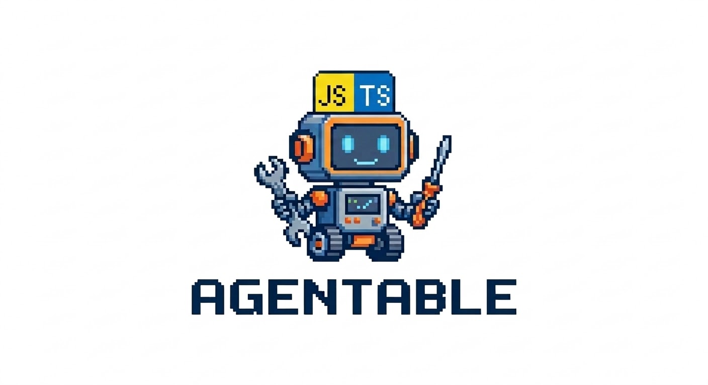

# Agentable

<p align="center">
  
</p>

[](https://github.com/zontaggio/agentable/actions/workflows/ci.yml)
[](https://www.typescriptlang.org/)
[](https://nodejs.org/)
[](LICENSE)

Agentable checks how ready your JS/TS repository is for AI agents. It scans 81 criteria across 9 categories and shows you a dashboard with scores, evidence, and a clear action plan.

## Why this exists

This project started as an open-source take on the Agent Readiness concept from Droid Factory: let a tool tell you what's missing in your repo before an AI agent starts working on it.

The problem is simple. When an agent works on a codebase that has no tests, no linter, vague docs, or missing type definitions, it hallucinates more. It makes changes that break things. It wastes your time.

Agentable audits your repo and tells you exactly what to fix so agents have guardrails. Better structure, better docs, better test coverage — all of that means fewer hallucinations and more useful agent output.

The focus is on **web projects in JavaScript and TypeScript**, since that's where most agent-assisted development is happening today.

## Quick start

```bash
npx agentable .
```

That's it. It runs the analysis, opens a local dashboard in your browser, and shows you where your repo stands.

You can also install it globally:

```bash
npm install -g agentable
agentable .
```

## How it works

1. Scans your repo: files, dependencies, configs, git history, and optionally GitHub metadata via `gh` CLI.
2. Detects your project profile (service vs library, monorepo, database usage, etc.) and skips criteria that don't apply.
3. Evaluates 81 criteria across 9 categories: testing, security, build system, documentation, dev environment, debugging, style/validation, task discovery, and product analytics.
4. Scores everything and opens a local dashboard with results, evidence, and a prioritized action plan.

Most checks are deterministic — they look at actual files and configs, not guesses. A few criteria can optionally use AI through OpenRouter, but the tool works fine without it.

## AI and model choices

Agentable uses [OpenRouter](https://openrouter.ai/) as the AI provider. It's optional — without it, AI-assisted criteria are marked as `unverified` and the rest works normally.

When you run `agentable --setup`, you pick from three model presets:

| Preset  | Model               | Why                                                                            |
| ------- | ------------------- | ------------------------------------------------------------------------------ |
| Default | `gpt-oss-120b`      | Cheapest option. Good enough for the few AI-assisted checks.                   |
| Top     | `claude-sonnet-4.6` | Best cost-to-quality ratio. Recommended if you want better AI guidance.        |
| Premium | `claude-opus-4.6`   | Best quality, higher cost. For when you want the best possible AI refinements. |

You can also use any custom model ID that OpenRouter supports.

The default is the cheapest model on purpose — Agentable only uses AI for 3 out of 81 criteria, so spending more only makes sense if you want the AI-refined action plan wording to be sharper.

## Why bother

Repos that score well on Agentable give agents less room to go wrong:

- **Clear types and contracts** mean the agent understands what functions expect and return.
- **Good test coverage** means the agent can verify its own changes.
- **Proper linting and formatting** means the agent's output matches your style without manual cleanup.
- **Solid documentation** means less guessing, less hallucination.
- **Defined tasks and backlog** means the agent knows what to work on and what's out of scope.

The payoff compounds. Every guardrail you add saves time on every future agent interaction. A repo that scores 80+ on Agentable is one where you can confidently point an agent at a task and expect useful output.

## Usage

```bash
agentable [path] [options]
```

| Option                                 | What it does                                                                                                        |
| -------------------------------------- | ------------------------------------------------------------------------------------------------------------------- |
| `--verbose`                            | More evidence detail in reports                                                                                     |
| `--no-gh`                              | Skip GitHub checks                                                                                                  |
| `--ai-failure-mode <fallback\|strict>` | What to do when AI is unavailable. Default: `fallback` (mark as unverified). `strict` requires a working AI config. |
| `--host <ip>`                          | Dashboard host (default: `127.0.0.1`)                                                                               |
| `--port <n>`                           | Dashboard port (default: `4173`)                                                                                    |
| `--setup`                              | Configure OpenRouter API key and model                                                                              |
| `--dry-run`                            | Show criteria catalog and exit without running analysis                                                             |

### Per-project overrides

Create a `.agentable.json` in your repo root to skip criteria that don't apply:

```json
{
  "skip": ["criterion_id"],
  "overrides": {
    "criterion_id": {
      "applicable": false,
      "reason": "Not relevant for this project"
    }
  }
}
```

## Contributing

Contributions are welcome. Whether it's new criteria, better evaluation logic, bug fixes, or documentation improvements — all of it helps.

Check [CONTRIBUTING.md](CONTRIBUTING.md) for setup instructions and conventions.

If you have ideas for new criteria or categories, open an issue first so we can discuss the approach before you write code.

## License

[MIT](LICENSE)
